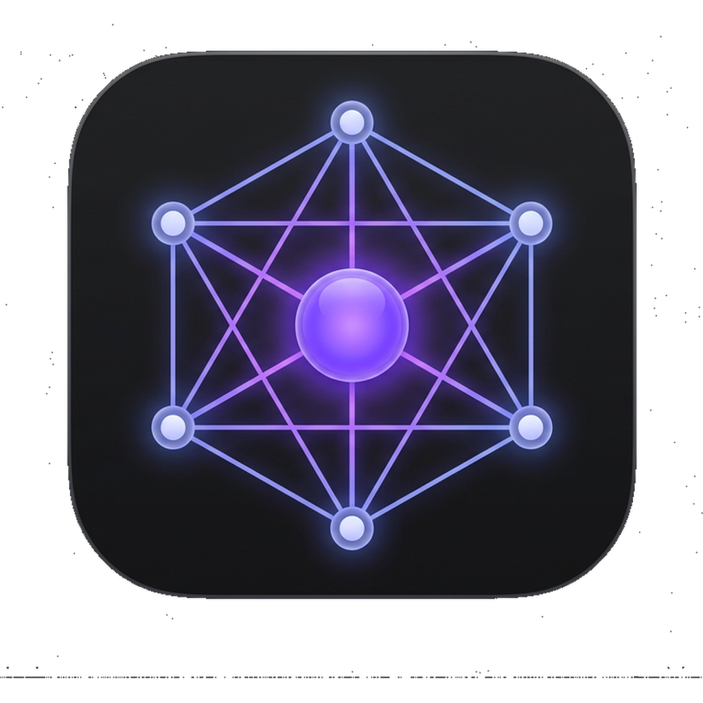

<div align="center">



# AI Hub

**All your AI assistants in one place.**

ChatGPT · Claude · Gemini · DeepSeek · Grok · Perplexity · Mistral · Qwen · Kimi

[](https://github.com/axiscoretech/ai-hub/releases/latest)
[](https://github.com/axiscoretech/ai-hub/releases/latest)
[](LICENSE)

</div>

---

## Why AI Hub?

If you use AI tools daily, you know the problem: browser tabs multiply endlessly, AI chats get buried under everything else, and you constantly lose context switching between tools.

AI Hub solves this.

**Your AI tabs live separately from your browser** — always at hand, never lost in a pile of 40 open tabs. One dock icon, one focused window.

**Hit a free-tier limit? Switch in one click.** Each service has its own isolated session, so you can be logged into ChatGPT, Claude, Gemini, DeepSeek, and others simultaneously. When one runs out of free messages, jump to the next — no re-login, no friction.

**Discover more than just ChatGPT.** Most people only know one or two AI tools. AI Hub puts nine of the best side by side — Gemini, DeepSeek, Grok, Perplexity, Mistral, Qwen, Kimi — so you can find the one that works best for your task.

**Built-in proxy** for routing around regional restrictions. **Chrome extensions** support for your favourite tools. All without leaving the app.

**No tokens, no subscriptions, no middleman.** Unlike aggregators that charge you for credits, AI Hub just opens the real websites — so you use whatever plan you already have, including all free tiers, directly.

---

## Quick Start

1. Download the latest release from [**Releases**](https://github.com/axiscoretech/ai-hub/releases/latest)
2. Open the `.dmg`
3. Drag **AI Hub.app** into `/Applications`
4. Launch the app

If macOS says the app is damaged, run:

```bash
xattr -cr /Applications/AI\ Hub.app
```

Then launch it again.

---

## Install

### Direct Download _(recommended for now)_

Download the right file for your Mac from [**Releases**](https://github.com/axiscoretech/ai-hub/releases/latest):

| Mac | File |
|-----|------|
| Apple Silicon (M1 / M2 / M3 / M4) | `AI-Hub-x.x.x-arm64.dmg` |
| Intel Mac | `AI-Hub-x.x.x.dmg` |

Open the DMG and drag **AI Hub.app** into `/Applications`.

If macOS reports that the app is damaged, clear the quarantine flag once and relaunch:

```bash
xattr -cr /Applications/AI\ Hub.app
```

### Homebrew

```bash
brew tap axiscoretech/tap
brew install --cask ai-hub
```

Direct DMG install is currently the safest option while signed notarized releases are still being finalized.

---

## Features

- **AI tabs separate from your browser** — no more losing chats among dozens of browser tabs
- **Jump between free tiers** — each service has its own isolated session, all logged in at once
- **Nine AI tools in one window** — ChatGPT, Claude, Gemini, DeepSeek, Grok, Perplexity, Qwen, Kimi, Mistral
- **Live tabs** — switch between services without reloading the page
- **Persistent sessions** — stay logged in between launches
- **Native macOS feel** — clean window chrome, traffic light controls, drag-friendly title area
- **Built-in proxy** — SOCKS5 / HTTP support for routing around regional restrictions
- **Chrome extensions** — load extensions from the Web Store directly inside the app
- **No tokens or subscriptions** — uses the real websites directly, so you keep your existing free tiers and paid plans without paying a middleman

---

## Supported services

| | Service | URL |
|---|---------|-----|
| 🤖 | ChatGPT | [chat.openai.com](https://chat.openai.com) |
| ✨ | Claude | [claude.ai](https://claude.ai) |
| 🌌 | Gemini | [gemini.google.com](https://gemini.google.com) |
| 🧠 | DeepSeek | [chat.deepseek.com](https://chat.deepseek.com) |
| ⚡ | Grok | [grok.com](https://grok.com) |
| 🔎 | Perplexity | [perplexity.ai](https://www.perplexity.ai) |
| 🌬️ | Mistral | [chat.mistral.ai](https://chat.mistral.ai) |
| 🐉 | Qwen | [chat.qwenlm.ai](https://chat.qwenlm.ai) |
| 🌙 | Kimi | [kimi.com](https://www.kimi.com) |

---

## Run from source

```bash
git clone https://github.com/axiscoretech/ai-hub
cd ai-hub
npm install
npm start
```

Requires [Node.js](https://nodejs.org) 18+ and [npm](https://npmjs.com).

---

## For Developers

## Build

```bash
npm run dist        # ARM64 + x64 DMG → dist/
npm run dist:arm    # Apple Silicon only
npm run dist:x64    # Intel only
```

## Maintainers

Apple code signing and notarization setup lives in [`docs/signing.md`](docs/signing.md).
Once Apple Developer access is available, add the required GitHub Actions secrets and future releases will be signed automatically.

---

<div align="center">

Made with ☕ · [axiscoretech](https://github.com/axiscoretech)

</div>
