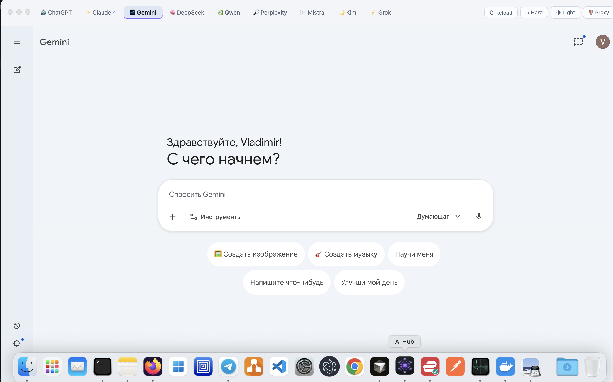

<div align="center">


# AI Hub

**All your AI assistants in one place.**

ChatGPT · Claude · Gemini · DeepSeek · Grok · Perplexity · Mistral · Qwen · Kimi

[](https://github.com/axiscoretech/ai-hub/releases/latest)
[](https://github.com/axiscoretech/ai-hub/releases/latest)
[](LICENSE)

</div>

---



---

A macOS and Windows app that wraps ChatGPT, Claude, Gemini, DeepSeek, Grok, Perplexity, Mistral, Qwen, and Kimi into a single native window. Each service runs in its own isolated session — logins persist, tabs stay live, and none of it clutters your browser.

---

## Features

- **Separate from your browser** — AI chats get their own dock icon and window, no longer buried under dozens of browser tabs
- **All sessions active at once** — each service is fully isolated: be logged into all nine simultaneously; when one free tier runs out, switch to the next without re-logging in
- **Nine AI tools in one place** — ChatGPT, Claude, Gemini, DeepSeek, Grok, Perplexity, Qwen, Kimi, Mistral side by side, easy to discover and compare
- **No tokens or subscriptions** — connects to the real websites directly, so your existing free and paid plans work as-is; no credits, no middleman
- **Live tabs** — switching between services does not reload the page
- **Persistent sessions** — stay logged in between app launches
- **Native window** — traffic light controls on macOS; clean frameless chrome on Windows
- **Built-in proxy** — SOCKS5 / HTTP for routing around regional restrictions
- **Chrome extensions** — load unpacked extensions or install from the Web Store directly in the app

---

## Quick Start

### macOS

1. Download the latest release from [**Releases**](https://github.com/axiscoretech/ai-hub/releases/latest)
2. Open the `.dmg`
3. Drag **AI Hub.app** into `/Applications`
4. Launch the app

If macOS says the app is damaged, run:

```bash
xattr -cr /Applications/AI\ Hub.app
```

Then launch it again.

### Windows

1. Download `AI-Hub-x.x.x-Setup.exe` from [**Releases**](https://github.com/axiscoretech/ai-hub/releases/latest)
2. Run the installer
3. Launch **AI Hub** from the Start Menu or Desktop shortcut

---

## Install

### macOS — Direct Download _(recommended for now)_

Download the right file for your Mac from [**Releases**](https://github.com/axiscoretech/ai-hub/releases/latest):

| Mac | File |
|-----|------|
| Apple Silicon (M1 / M2 / M3 / M4) | `AI-Hub-x.x.x-arm64.dmg` |
| Intel Mac | `AI-Hub-x.x.x.dmg` |

Open the DMG and drag **AI Hub.app** into `/Applications`.

If macOS reports that the app is damaged, clear the quarantine flag once and relaunch:

```bash
xattr -cr /Applications/AI\ Hub.app
```

### macOS — Homebrew

```bash
brew tap axiscoretech/tap
brew install --cask ai-hub
```

Direct DMG install is currently the safest option while signed notarized releases are still being finalized.

### Windows — Direct Download

Download `AI-Hub-x.x.x-Setup.exe` from [**Releases**](https://github.com/axiscoretech/ai-hub/releases/latest) and run the installer.

| Windows | File |
|---------|------|
| 64-bit (x64) | `AI-Hub-x.x.x-Setup.exe` |

---

## Supported services

| | Service | URL |
|---|---------|-----|
| 🤖 | ChatGPT | [chat.openai.com](https://chat.openai.com) |
| ✨ | Claude | [claude.ai](https://claude.ai) |
| 🌌 | Gemini | [gemini.google.com](https://gemini.google.com) |
| 🧠 | DeepSeek | [chat.deepseek.com](https://chat.deepseek.com) |
| ⚡ | Grok | [grok.com](https://grok.com) |
| 🔎 | Perplexity | [perplexity.ai](https://www.perplexity.ai) |
| 🌬️ | Mistral | [chat.mistral.ai](https://chat.mistral.ai) |
| 🐉 | Qwen | [chat.qwenlm.ai](https://chat.qwenlm.ai) |
| 🌙 | Kimi | [kimi.com](https://www.kimi.com) |

---

## Run from source

```bash
git clone https://github.com/axiscoretech/ai-hub
cd ai-hub
npm install
npm start
```

Requires [Node.js](https://nodejs.org) 18+ and [npm](https://npmjs.com).

---

## For Developers

## Build

```bash
npm run dist        # macOS ARM64 + x64 DMG → dist/
npm run dist:arm    # Apple Silicon only
npm run dist:x64    # Intel Mac only
npm run dist:win    # Windows x64 NSIS installer → dist/
```

## Maintainers

Apple code signing and notarization setup lives in [`docs/signing.md`](docs/signing.md).
Once Apple Developer access is available, add the required GitHub Actions secrets and future releases will be signed automatically.

---

<div align="center">

Made with ☕ · [axiscoretech](https://github.com/axiscoretech)

</div>
