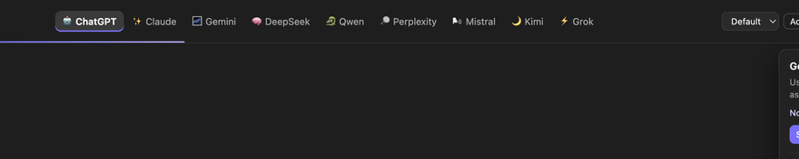

<div align="center">


# AI Hub

**Separate sessions, a tunnel only for the hub tabs you choose, and no typing into those sites for you.**

ChatGPT · Claude · Gemini · DeepSeek · Grok · Perplexity · Mistral · Qwen · Kimi · OpenClaw

[](https://github.com/axiscoretech/ai-hub/releases/latest)
[](https://github.com/axiscoretech/ai-hub/releases/latest)
[](LICENSE)

</div>

---



*Switch tabs without reloading. Each service keeps its own login.*

---

A macOS, Windows, and Linux app that keeps ChatGPT, Claude, Gemini, DeepSeek, Grok, Perplexity, Mistral, Qwen, Kimi, and a local [OpenClaw](https://openclaw.ai) gateway in one native window. Each service has its own session, and a service can hold more than one account. Logins persist, tabs stay live, and the chats stay out of your browser. The app opens the real websites. It does not type into them.

---

## Features

- **Separate from your browser** — AI chats get their own dock icon and window
- **Isolated sessions** — stay logged in to every service at once. A service can hold more than one account, each with its own login
- **Live tabs** — switching services does not reload the page
- **Compare** — put two or three chats side by side, insert the task text into the focused chat without sending it, and keep the task board
- **WireGuard** — send the hub tabs you choose through a WireGuard config. Other services can stay on a direct connection. This does not change the rest of your Mac, PC, or Linux machine
- **Your own sites** — add an https address when a service is missing from the list. Hide a tab from the flag panel when you do not want it
- **Theme** — dark, light, or match the system
- **OpenClaw** — a tab for a local OpenClaw gateway, if you have one installed

The app opens the real websites. It does not sell credits, and it does not type into those sites for you.

---

## Privacy

AI Hub does not send telemetry. It talks to the sites you open, to GitHub when it downloads `wireproxy`, and to GitHub Releases when it checks for an app update.

What stays on this computer, under the app's user data folder (`~/Library/Application Support/AI Hub` on macOS, `%APPDATA%\AI Hub` on Windows, `~/.config/AI Hub` on Linux):

- **Logins.** Each service tab has its own session partition (`Partitions/persist:<service>`). Cookies stay in that partition.
- **WireGuard configs.** Imported `.conf` files are encrypted with the operating system key store (Keychain on macOS, DPAPI on Windows, the desktop keyring on Linux) and stored in `wireguard/`. If encryption is not available, AI Hub refuses to save the config. A plaintext copy exists only while that tunnel is running, then it is deleted.
- **Compare tasks.** `tasks.json`.
- **Shared Google account book.** `google-accounts.json`.
- **Extensions.** `extensions/`.

---

## The window

The service names are tabs. The buttons on the right are icons:

| Icon | Action |
|------|--------|
| Circular arrow | Reload the current page (`Cmd/Ctrl+R`) |
| Circular arrow with a dot | Reload ignoring cache (`Cmd/Ctrl+Shift+R`) |
| Moon, sun, or display | Theme. Click to cycle dark, light, and system |
| Two columns | Compare (`Cmd/Ctrl+Shift+B`) |
| Flag | WireGuard. After a connection finds its exit country, the flag becomes that country's flag |

`Escape` leaves Compare and returns to the current chat.

---

## Compare


Compare is a board in the shell, not a second account system.

1. Click the two-column icon, or press `Cmd/Ctrl+Shift+B`.
2. Enter a title and the text you want to paste into the chats.
3. Tick the services you want on the task, then choose **Add task**.
4. **Copy** puts the text on the clipboard. Paste it into the chat yourself.
5. **Open** switches to that service. A queued assignment becomes **Doing**. If you already opened that chat from this task, AI Hub returns to the saved page.
6. Set the status yourself: **Queued**, **Doing**, **Ready**, or **Done**.

An amber dot means the background tab's title changed while that assignment was **Doing**. It is a nudge to look, not proof that the answer is finished. Opening the assignment, or changing its status, clears the dot.

You can keep up to 50 tasks. Delete a task from its card. Removing the last service on a task is refused, so a task always points at somewhere.

---

## WireGuard


1. Click the flag.
2. Choose **Import .conf** and pick one or more WireGuard config files.
3. Choose **Connect** on the config you want. **Switch location** moves the hub tabs to another imported config.
4. **Disconnect** returns those tabs to a direct connection.

Only AI Hub's service tabs use the tunnel. The rest of the system network stays as it is. The first time you connect, the app can download `wireproxy` if it is not already installed (`brew install wireproxy` installs it yourself). When the exit location is known, the flag icon shows that country.

---

## OpenClaw

OpenClaw is the local personal assistant previously called Clawd, Clawdbot, and Moltbot. AI Hub does not install it for you.

If the gateway is already running, the OpenClaw tab opens its dashboard. If it is missing or stopped, the tab explains the official install command and can start a gateway that is already installed. Pairing stays on that machine.

---

## Quick Start

### macOS — one command

Latest release, into `/Applications`, then Launchpad. Apple Silicon and Intel are chosen for you.

```bash
curl -fsSL https://raw.githubusercontent.com/axiscoretech/ai-hub/master/install.sh | bash
```

The script installs the latest release into `/Applications` and opens it. A notarized build opens without an extra prompt. If the signature is not accepted, the script clears the quarantine flag once.

<details>
<summary>If macOS still blocks the app</summary>

This happens when the app was downloaded by hand and is not notarized yet.

1. Open **System Settings**.
2. Go to **Privacy & Security**.
3. Scroll to the **Security** section at the bottom.
4. Next to the message that AI Hub was blocked, click **Open Anyway**, then confirm **Open**.

If that button is not there: in Finder open **Applications**, right-click **AI Hub**, choose **Open**, and confirm **Open** in the dialog.

</details>

### macOS — DMG

1. Download the latest release from [**Releases**](https://github.com/axiscoretech/ai-hub/releases/latest)
2. Open the `.dmg`
3. Drag **AI Hub.app** into `/Applications`
4. Launch the app

Use the Apple Settings steps above if macOS refuses the first launch.

### Windows

1. Download `AI-Hub-x.x.x-Setup.exe` from [**Releases**](https://github.com/axiscoretech/ai-hub/releases/latest)
2. Run the installer
3. Launch **AI Hub** from the Start Menu or Desktop shortcut

### Linux

Download the `.AppImage` for your machine from [**Releases**](https://github.com/axiscoretech/ai-hub/releases/latest), mark it executable, and run it. `wireproxy` can be downloaded by the app or installed yourself.

---

## Install

### macOS — One command _(recommended)_

```bash
curl -fsSL https://raw.githubusercontent.com/axiscoretech/ai-hub/master/install.sh | bash
```

The app lands in `/Applications` and opens. A notarized build does not need a quarantine exception. The script clears that flag only when macOS does not accept the signature.

A notarized build, once Apple signing secrets are set, is the step that lets a plain DMG open with no script and no warning. Setup for that is in [`docs/signing.md`](docs/signing.md).

### macOS — Direct Download

Download the right file for your Mac from [**Releases**](https://github.com/axiscoretech/ai-hub/releases/latest):

| Mac | File |
|-----|------|
| Apple Silicon (M1 / M2 / M3 / M4) | `AI-Hub-x.x.x-arm64.dmg` |
| Intel Mac | `AI-Hub-x.x.x.dmg` |

Open the DMG and drag **AI Hub.app** into `/Applications`.

If macOS blocks this copy, use **System Settings → Privacy & Security → Security → Open Anyway**, or right-click **AI Hub** in **Applications** and choose **Open**.

### macOS — Homebrew

```bash
brew tap axiscoretech/tap
brew install --cask ai-hub
```

Homebrew also puts the app in `/Applications` and skips the manual Gatekeeper prompt. The one-command install above does the same thing without Homebrew.

### Windows — Direct Download

Download `AI-Hub-x.x.x-Setup.exe` from [**Releases**](https://github.com/axiscoretech/ai-hub/releases/latest) and run the installer.

| Windows | File |
|---------|------|
| 64-bit (x64) | `AI-Hub-x.x.x-Setup.exe` |

---

## Supported services

| | Service | URL |
|---|---------|-----|
| | ChatGPT | [chatgpt.com](https://chatgpt.com) |
| | Claude | [claude.ai](https://claude.ai) |
| | Gemini | [gemini.google.com](https://gemini.google.com) |
| | DeepSeek | [chat.deepseek.com](https://chat.deepseek.com) |
| | Grok | [grok.com](https://grok.com) |
| | Perplexity | [perplexity.ai](https://www.perplexity.ai) |
| | Mistral | [chat.mistral.ai](https://chat.mistral.ai) |
| | Qwen | [chat.qwen.ai](https://chat.qwen.ai) |
| | Kimi | [kimi.com](https://www.kimi.com) |
| | OpenClaw | local gateway, usually `127.0.0.1:18789` |

ChatGPT may still pass through `chat.openai.com` before it lands on `chatgpt.com`. Both stay inside the ChatGPT tab.

---

## Run from source

```bash
git clone https://github.com/axiscoretech/ai-hub
cd ai-hub
npm install
npm start
```

Requires [Node.js](https://nodejs.org) 18+ and [npm](https://npmjs.com).

```bash
npm test   # board, WireGuard, services, and an Electron smoke check
```

---

## For Developers

## Build

```bash
npm run dist        # macOS ARM64 + x64 DMG → dist/
npm run dist:arm    # Apple Silicon only
npm run dist:x64    # Intel Mac only
npm run dist:win    # Windows x64 NSIS installer → dist/
npm run dist:linux  # Linux AppImage → dist/
npm run open-app    # unpacked macOS app in dist/mac, then open it
```

## Maintainers

Apple code signing and notarization setup lives in [`docs/signing.md`](docs/signing.md).
Once Apple Developer access is available, add the required GitHub Actions secrets and future releases will be signed automatically.

---

<div align="center">

Made with ☕ · [axiscoretech](https://github.com/axiscoretech)

</div>
