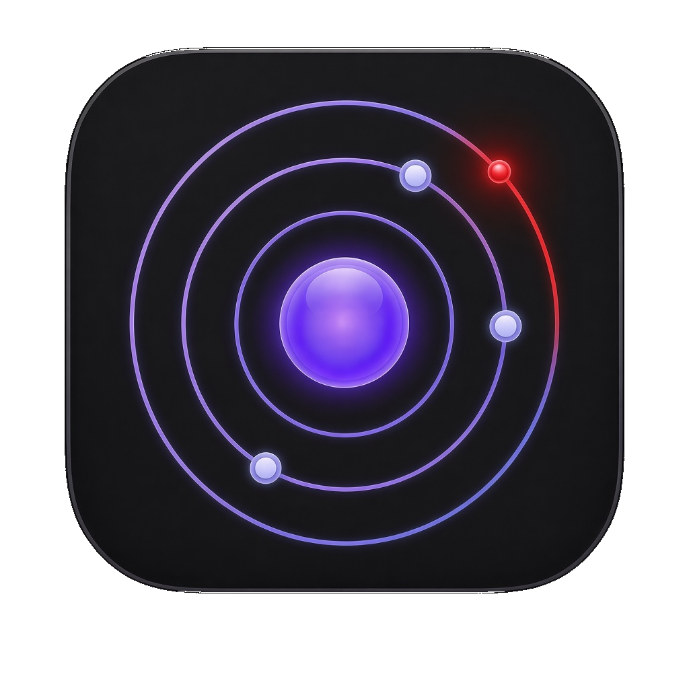
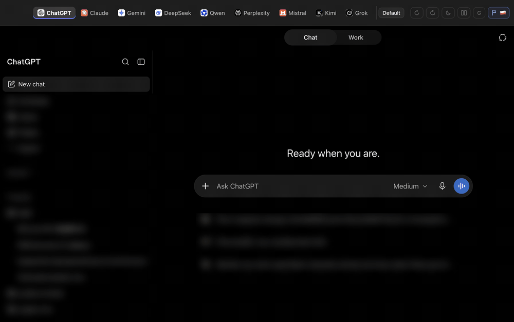
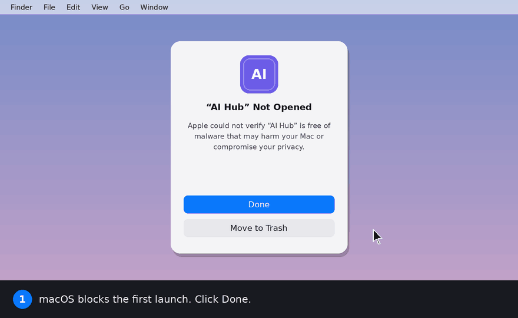
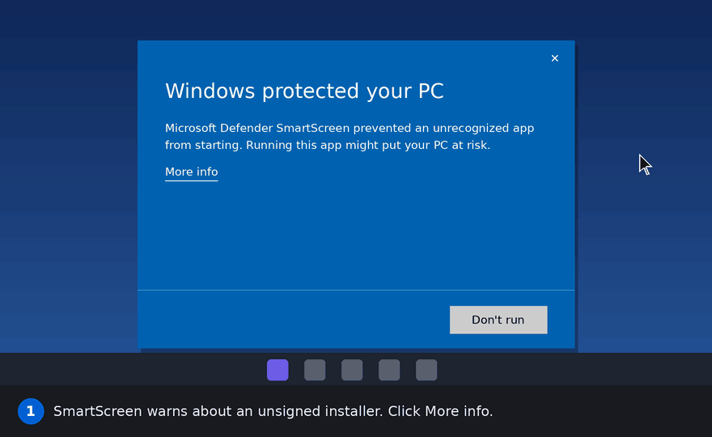
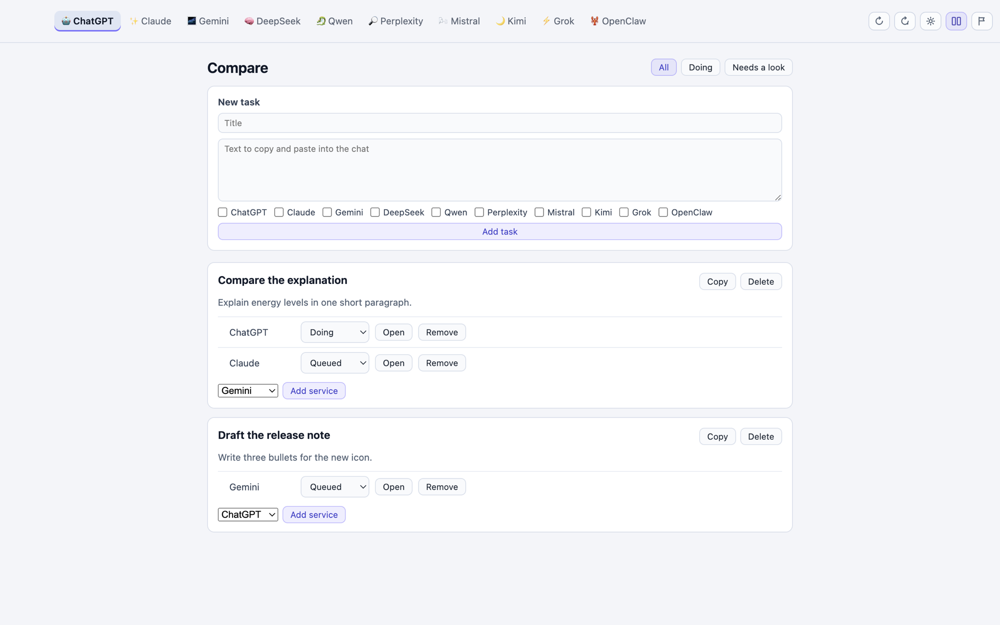
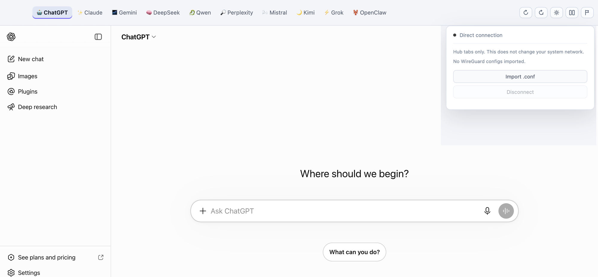

<div align="center">

**Русский** · [English](README.en.md)



# AI Hub

**Все ваши чаты с ИИ в одном окне — на их бесплатных тарифах.**

Без API-ключей. Без покупки токенов. Свой WireGuard (VPN-туннель) только для вкладок хаба.

ChatGPT · Claude · Gemini · DeepSeek · Grok · Perplexity · Mistral · Qwen · Kimi · OpenClaw

[](https://github.com/axiscoretech/ai-hub/releases/latest)
[](https://github.com/axiscoretech/ai-hub/releases/latest)
[](LICENSE)

</div>

---



*Тёмная тема, вход выполнен. Переключение вкладок не перезагружает страницу. Флаг меняется вместе со страной выхода WireGuard.*

---

Приложение для macOS, Windows и Linux, которое держит ChatGPT, Claude, Gemini, DeepSeek, Grok, Perplexity, Mistral, Qwen, Kimi и локальный шлюз [OpenClaw](https://openclaw.ai) в одном окне.

AI Hub открывает настоящие сайты, поэтому каждым сервисом вы пользуетесь так, как он доступен всем: бесплатный тариф, без API-ключа и без оплаты за токены. Когда у одного сервиса кончается бесплатный лимит, переключаетесь на следующую вкладку и продолжаете. Каждая вкладка уже со входом и остаётся там, где вы её оставили. Платные аккаунты работают так же: вошли, и вкладка использует вашу подписку.

## Зачем AI Hub

- **Сначала бесплатные тарифы.** Другие приложения для нескольких чатов просят API-ключи и предоплату. AI Hub не просит ни того ни другого: это тот веб-чат, которым вы уже пользуетесь, а не перепродажа токенов
- **Без россыпи вкладок.** Одна живая вкладка на сервис, своё окно и своя иконка в Dock, а не десяток вкладок браузера, которые выходят из аккаунта и перезагружаются
- **WireGuard только для хаба.** Если сервис недоступен в вашем регионе, вкладки с ИИ идут через ваш конфиг WireGuard. Браузер, банковские приложения и остальная система остаются на прямом соединении

---

## Возможности

- **Отдельно от браузера** — чаты получают свою иконку в Dock и своё окно
- **Живые вкладки** — переключение сервиса не перезагружает страницу. Вход сохраняется между запусками
- **Отдельные сессии** — можно быть вошедшим во все сервисы сразу. У сервиса может быть больше одного аккаунта, например рабочий и личный. У каждого свой вход и свой туннель или прямое соединение
- **Compare** — два или три чата рядом. Текст задачи вставляется в чат, на котором фокус, без отправки, и доска задач остаётся
- **WireGuard** — выбранные вкладки хаба идут через конфиг WireGuard. Остальные сервисы могут остаться на прямом соединении. Сеть остального Mac, PC или компьютера с Linux при этом не меняется
- **Свои сайты** — добавьте адрес https, если сервиса нет в списке. Скройте вкладку в панели флага, если она не нужна
- **Тема** — тёмная, светлая или как в системе
- **OpenClaw** — вкладка локального шлюза OpenClaw. Установка и обновление сначала спрашивают и берут официальный источник

Приложение открывает настоящие сайты. Оно не продаёт кредиты и не отправляет текст на эти сайты за вас.

---

## Установка

### macOS — одна команда

Последний релиз попадает в `/Applications`, затем в Launchpad. Apple Silicon и Intel выбираются сами.

```bash
curl -fsSL https://raw.githubusercontent.com/axiscoretech/ai-hub/master/install.sh | bash
```

Скрипт ставит последний релиз в `/Applications` и открывает его. Нотаризованная сборка открывается без лишнего запроса. Если подпись не принята, скрипт один раз снимает карантин.

Если macOS всё равно блокирует приложение, шаги ниже, в разделе про DMG (образ диска).

Настройка нотаризации для тех, кто выпускает сборки, — в [`docs/signing.md`](docs/signing.md).

### macOS — DMG

1. Скачайте последний релиз со страницы [**Releases**](https://github.com/axiscoretech/ai-hub/releases/latest): `AI-Hub-x.x.x-arm64.dmg` для Apple Silicon (M1–M4), `AI-Hub-x.x.x.dmg` для Intel
2. Откройте `.dmg`
3. Перетащите **AI Hub.app** в `/Applications`
4. Запустите приложение

Перед открытием сравните сумму SHA-256 с той, что GitHub показывает рядом с файлом на странице релиза. На Mac: `shasum -a 256 ~/Downloads/AI-Hub-x.x.x.dmg` (сборки Apple Silicon называются `AI-Hub-x.x.x-arm64.dmg`). Те же суммы лежат в файле `SHA256SUMS` на этой странице.

<details>
<summary>macOS говорит, что приложение нельзя открыть?</summary>



Картинки сняты на macOS 15 и новее. Надписи на вашем Mac могут отличаться. Нажмите **Готово**, затем **Системные настройки → Конфиденциальность и безопасность**, прокрутите до **Безопасность** и выберите **Всё равно открыть** (Open Anyway). Подтвердите и введите пароль Mac. Это один раз для каждой скачанной версии.

</details>

### macOS — Homebrew

```bash
brew tap axiscoretech/tap
brew install --cask ai-hub
```

### Windows

1. Скачайте `AI-Hub-x.x.x-Setup.exe` со страницы [**Releases**](https://github.com/axiscoretech/ai-hub/releases/latest)
2. Запустите установщик
3. Откройте **AI Hub** из меню Пуск или с ярлыка на рабочем столе

Перед запуском сравните сумму SHA-256 с той, что GitHub показывает рядом с файлом. В PowerShell: `Get-FileHash .\AI-Hub-x.x.x-Setup.exe -Algorithm SHA256`.

<details>
<summary>SmartScreen говорит, что защитил компьютер?</summary>



Нажмите **Подробнее** (More info), проверьте, что файл называется `AI-Hub-Setup-x.x.x.exe`, затем **Выполнить в любом случае** (Run anyway). Предупреждение есть, потому что установщик пока не подписан.

</details>

### Linux

Скачайте `.AppImage` для своей машины со страницы [**Releases**](https://github.com/axiscoretech/ai-hub/releases/latest), сделайте файл исполняемым и запустите. `wireproxy` может скачать само приложение, или поставьте его сами.

---

## Конфиденциальность

AI Hub не отправляет телеметрию. Он обращается к сайтам, которые вы открываете, к GitHub, когда скачивает `wireproxy`, и к GitHub Releases, когда проверяет обновление приложения. Скачанное обновление предлагается к установке только после того, как его SHA-256 совпал с файлом `SHA256SUMS` этого релиза. Пока приложение не нотаризовано, macOS всё равно просит Gatekeeper (защиту системы) подтвердить обновление.

Что остаётся на этом компьютере, в папке данных приложения (`~/Library/Application Support/AI Hub` на macOS, `%APPDATA%\AI Hub` на Windows, `~/.config/AI Hub` на Linux):

- **Входы.** У каждого аккаунта своя сессия. Первый аккаунт сервиса — `Partitions/persist:<service>`. Следующий — `Partitions/persist:<service>:<account>`. Куки остаются в этой сессии. На macOS они не лежат в связке ключей входа, поэтому открытие приложения не спрашивает этот пароль второй раз. Сохранённый туннель WireGuard всё же обращается к связке ключей один раз, когда подключается снова.
- **Конфиги WireGuard.** Импортированные файлы `.conf` шифруются хранилищем ключей системы (Keychain на macOS, DPAPI на Windows, связка ключей рабочего стола на Linux) и лежат в `wireguard/`. Если шифрование недоступно, AI Hub отказывается сохранять конфиг. Открытая копия есть только пока туннель работает, потом она удаляется.
- **Задачи Compare.** `tasks.json`.
- **Общая книга аккаунтов Google.** `google-accounts.json` записывает, какие профили делят один вход Google. Профили, оставленные отдельно, в эту группу не входят.
- **Вход OpenClaw.** Токен панели сюда не пишется. Приложение запускает `openclaw dashboard --no-open`, читает локальный адрес из буфера обмена (токен — это фрагмент адреса), держит его в памяти этого окна и возвращает прежний текст буфера.
- **Расширения.** `extensions/`.

---

## Окно

Названия сервисов — это вкладки. Кнопки справа — значки:

| Значок | Действие |
|------|--------|
| Круговая стрелка | Перезагрузить текущую страницу (`Cmd/Ctrl+R`) |
| Круговая стрелка с точкой | Перезагрузить, не используя кэш (`Cmd/Ctrl+Shift+R`) |
| Луна, солнце или монитор | Тема. Нажатие переключает тёмную, светлую и системную |
| Две колонки | Compare (`Cmd/Ctrl+Shift+B`) |
| Флаг | WireGuard. Когда соединение находит страну выхода, флаг становится флагом этой страны |

`Escape` выходит из Compare и возвращает к текущему чату.

---

## Compare



**Принцип:** AI Hub не отправляет ваш текст на сайты за вас.

Compare — это доска в оболочке приложения, а не вторая система аккаунтов.

1. Нажмите значок двух колонок или `Cmd/Ctrl+Shift+B`.
2. Введите заголовок и текст, который хотите вставить в чаты.
3. Отметьте сервисы и нажмите **Add task**.
4. **Copy** кладёт текст в буфер обмена. В чат вставляете сами.
5. **Open** переключает на этот сервис. Задание в очереди становится **Doing**. Если этот чат уже открывали из этой задачи, AI Hub возвращает сохранённую страницу.
6. Статус ставите сами: **Queued**, **Doing**, **Ready** или **Done**.

Янтарная точка значит, что заголовок фоновой вкладки изменился, пока задание было **Doing**. Это повод посмотреть, а не доказательство, что ответ готов. Точка снимается, когда вы открываете задание или меняете его статус.

Задач можно хранить до 50. Удаление — с карточки задачи. Убрать последний сервис с задачи нельзя: у задачи всегда есть куда идти.

**Insert**, когда чаты стоят рядом, ставит фокус в поле сообщения того чата, по которому вы нажали, и вписывает туда текст задачи. Это работает и с редакторами ProseMirror у Claude и ChatGPT. Кнопку отправки оно не нажимает.

---

## WireGuard



1. Нажмите флаг.
2. Выберите **Import .conf** и укажите один или несколько файлов конфига WireGuard.
3. Нажмите **Connect** у нужного конфига. **Switch location** переводит аккаунты туннеля на другой импортированный конфиг.
4. **Disconnect** возвращает эти аккаунты на прямое соединение.

Туннель используют только аккаунты, у которых выбран Tunnel. Маршрут задаётся для каждого аккаунта, поэтому рабочий и личный профиль одного сервиса могут выходить в разных странах. Остальная сеть системы остаётся как была. Если у аккаунта уже есть сессия сайта, смена маршрута предупреждает, что аккаунт увидит смену страны.

У аккаунтов на туннеле также блокируется WebRTC по UDP, который иначе обошёл бы прокси и показал настоящий адрес. Блокировка остаётся, если туннель оборвался и аккаунт отрезан от сети. У аккаунтов с Direct обычный WebRTC сохраняется.

При первом подключении приложение может скачать `wireproxy`, если его ещё нет (`brew install wireproxy` ставит его самим). Когда место выхода известно, значок флага показывает эту страну.

В панели флага у каждого аккаунта свой выбор: **Tunnel** или **Direct**. OpenClaw остаётся на этом компьютере, и выбора туннеля у него нет.

---

## Google

Кнопка **G** делит один вход Google только с профилями, которые вы отметили **Shared**. Профиль **Own account** держит отдельный вход Google. Новый дополнительный аккаунт начинается как свой. **Sign in shared profiles** копирует общую сессию Google в профили этой группы и не трогает остальные.

---

## OpenClaw

OpenClaw — локальный помощник, который раньше назывался Clawd, Clawdbot и Moltbot.

Если OpenClaw нет, **Install OpenClaw** сначала спрашивает, затем скачивает [https://openclaw.ai/install.sh](https://openclaw.ai/install.sh) и запускает этот скрипт через `/bin/bash`. Другого установщика нет, а переход с `openclaw.ai` отклоняется. **Update** сначала спрашивает, затем запускает `openclaw update --yes --json --timeout 600` тем OpenClaw, который уже стоит на этом компьютере.

Вход не использует пароль, который вы вводите в AI Hub. Приложение запускает `openclaw dashboard --no-open`. OpenClaw копирует локальный адрес панели в буфер обмена, и токен входа — это фрагмент этого адреса. AI Hub его читает, открывает страницу, возвращает прежний текст буфера и держит токен в памяти окна. В файлы приложения он не пишется.

Если шлюз уже запущен, вкладка OpenClaw открывает его панель. Сопряжение остаётся на этой машине.

---

## Сервисы

| | Сервис | Адрес |
|---|---|-----|
|  | ChatGPT | [chatgpt.com](https://chatgpt.com) |
|  | Claude | [claude.ai](https://claude.ai) |
|  | Gemini | [gemini.google.com](https://gemini.google.com) |
|  | DeepSeek | [chat.deepseek.com](https://chat.deepseek.com) |
|  | Grok | [grok.com](https://grok.com) |
|  | Perplexity | [perplexity.ai](https://www.perplexity.ai) |
|  | Mistral | [chat.mistral.ai](https://chat.mistral.ai) |
|  | Qwen | [chat.qwen.ai](https://chat.qwen.ai) |
|  | Kimi | [kimi.com](https://www.kimi.com) |
|  | OpenClaw | локальный шлюз, обычно `127.0.0.1:18789` |

ChatGPT может пройти через `chat.openai.com`, прежде чем окажется на `chatgpt.com`. Оба адреса остаются во вкладке ChatGPT.

---

## Запуск из исходников

```bash
git clone https://github.com/axiscoretech/ai-hub
cd ai-hub
npm install
npm start
```

Нужны [Node.js](https://nodejs.org) 18+ и [npm](https://npmjs.com).

```bash
npm test   # доска, WireGuard, сервисы и проверка запуска Electron
```

---

## Для разработчиков

## Сборка

```bash
npm run dist        # DMG для macOS ARM64 и x64 → dist/
npm run dist:arm    # только Apple Silicon
npm run dist:x64    # только Intel
npm run dist:win    # установщик Windows x64 → dist/
npm run dist:linux  # AppImage для Linux → dist/
npm run open-app    # распакованное приложение macOS в dist/mac, затем открыть его
```

## Тем, кто выпускает сборки

Подпись и нотаризация Apple описаны в [`docs/signing.md`](docs/signing.md).
Когда появится доступ Apple Developer, добавьте нужные секреты GitHub Actions, и следующие релизы будут подписываться сами.

---

<div align="center">

Сделано с ☕ · [axiscoretech](https://github.com/axiscoretech)

</div>
